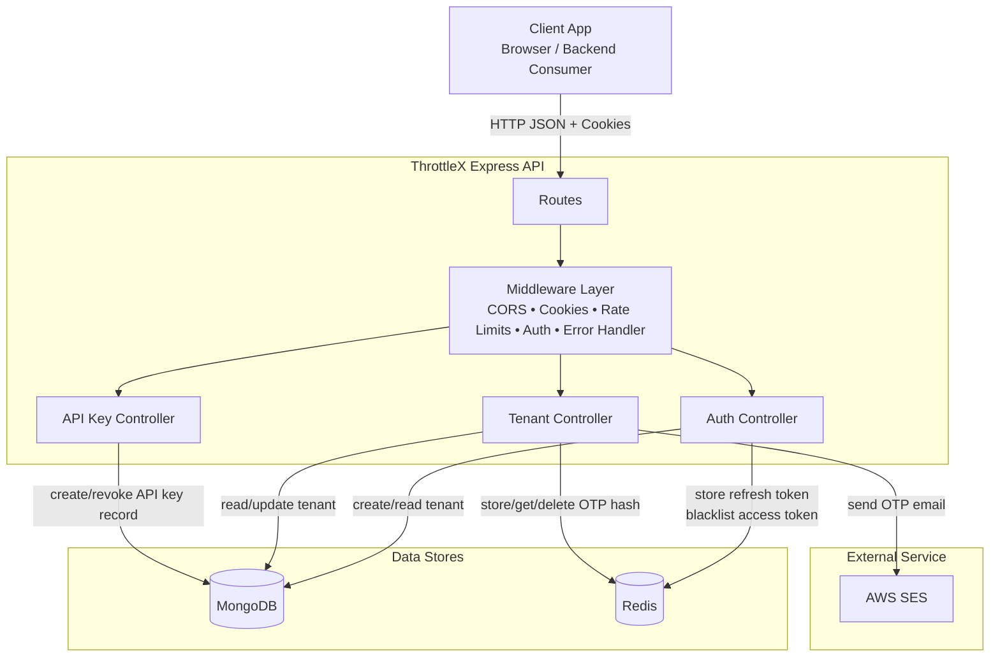

# ThrottleX API

ThrottleX is an Express 5 API for multi-tenant authentication, OTP verification, and tenant-scoped API key lifecycle management. It uses MongoDB for primary persistence, Redis for short-lived auth state and OTP storage, and AWS SES for email delivery.

## Overview

- Multi-tenant registration and login
- JWT access tokens with rotating refresh tokens
- Refresh token persistence and access-token blacklist in Redis
- OTP send and verification flow over AWS SES
- Tenant profile retrieval for authenticated users
- Tenant-scoped API key generation and revocation
- Global and endpoint-specific rate limiting
- Environment validation during boot

## Tech Stack

- Node.js
- Express 5
- MongoDB with Mongoose
- Redis with ioredis
- JWT with `jsonwebtoken`
- AWS SES v3
- `express-rate-limit`
- Joi for environment validation

## Project Structure

```text
.
|-- api/
|   |-- controllers/
|   |-- middleware/
|   |-- models/
|   |-- routes/
|   |-- utils/
|-- aws/
|-- config/
|-- database/
|-- redis/
|-- index.js
|-- dockerfile
|-- package.json
|-- README.md
|-- docs/
|   |-- system-design.mmd
```

## Architecture

The API receives HTTP requests from browser or server-side clients, validates origin and rate limits, authenticates JWTs, persists tenant and API key records in MongoDB, stores refresh tokens and OTP hashes in Redis, and sends OTP emails through AWS SES.



## Prerequisites

- Node.js 18+
- MongoDB
- Redis
- AWS SES credentials
- A verified SES sender address

## Setup

1. Install dependencies:

```bash
npm install
```

2. Create a `.env` file in the project root:

```env
PORT=3000
NODE_ENV=development

MONGO_URI=mongodb://localhost:27017/throttlex

CORS_ORIGIN=http://localhost:5173

REDIS_HOST=localhost
REDIS_PORT=6379
REDIS_PASSWORD=

ACCESS_TOKEN_SECRET=replace-with-at-least-32-characters
REFRESH_TOKEN_SECRET=replace-with-at-least-32-characters

AWS_ACCESS_KEY_ID=your-access-key
AWS_SECRET_ACCESS_KEY=your-secret-key
AWS_SES_REGION=ap-south-1
AWS_SES_SOURCE_EMAIL=verified-sender@example.com
```

3. Start the server:

```bash
npm run dev
```

Production:

```bash
npm start
```

Default base URL: `http://localhost:3000`

## Environment Variables

Validated at startup in [config/env.js](/Users/josephremingstonl/Downloads/code/ThrottleX/config/env.js).

### Required

- `MONGO_URI`
- `ACCESS_TOKEN_SECRET`
- `REFRESH_TOKEN_SECRET`
- `AWS_ACCESS_KEY_ID`
- `AWS_SECRET_ACCESS_KEY`
- `AWS_SES_REGION`
- `AWS_SES_SOURCE_EMAIL`

### Optional

- `PORT`
- `NODE_ENV`
- `CORS_ORIGIN`
- `REDIS_HOST`
- `REDIS_PORT`
- `REDIS_PASSWORD`

## Auth Model

- Access tokens are JWTs signed with `ACCESS_TOKEN_SECRET` and expire in `15m`.
- Refresh tokens are JWTs signed with `REFRESH_TOKEN_SECRET` and expire in `7d`.
- Refresh tokens are stored in Redis under `refresh:{tenantId}`.
- Logout blacklists the current access token in Redis until its natural expiry.
- The refresh token is issued as an HTTP-only cookie named `refreshToken`.

### Refresh Cookie Behavior

- `httpOnly=true`
- `path=/`
- `maxAge=7 days`
- Development: `sameSite=lax`, `secure=false`
- Production: `sameSite=none`, `secure=true`

### CORS and Trusted-Origin Enforcement

- `CORS_ORIGIN` supports a comma-separated allowlist.
- Requests with a refresh cookie to `/api/auth/refresh` and `/api/auth/logout` must come from an allowed `Origin` or `Referer`.
- If the origin check fails, the API returns `403 Cross-site cookie request blocked`.

## Response Format

Successful controller responses use this shape:

```json
{
  "statusCode": 200,
  "message": "Success message",
  "data": {}
}
```

Error responses are returned by the centralized error handler and usually use this shape:

```json
{
  "statusCode": 400,
  "message": "Description of the error"
}
```

In `NODE_ENV=development`, error responses also include `stack`.

## API Reference

Base URL examples use `http://localhost:3000`.

### Health

#### `GET /`

Simple health/welcome endpoint.

Response:

```json
{
  "message": "Welcome to ThrottleX API"
}
```

### Authentication

#### `POST /api/auth/register`

Create a tenant account.

Request body:

```json
{
  "name": "Acme Inc",
  "email": "owner@acme.com",
  "password": "StrongPass123!",
  "accountType": "test"
}
```

Validation and behavior:

- `name`, `email`, and `password` are required.
- `accountType` must be `test` or `live`.
- `email` is trimmed and normalized to lowercase.
- Passwords are hashed with bcrypt before persistence.

Success response:

```json
{
  "statusCode": 200,
  "message": "Tenant registered successfully",
  "data": {
    "tenant": {
      "id": "67f0d1b2c3d4e5f678901234",
      "name": "Acme Inc",
      "email": "owner@acme.com",
      "accountType": "test",
      "createdAt": "2026-04-02T10:00:00.000Z"
    }
  }
}
```

Common errors:

- `400 Name is required`
- `400 Email is required`
- `400 Password is required`
- `400 Account type must be "test" or "live"`
- `400 Email already in use`

#### `POST /api/auth/login`

Authenticate a tenant and issue tokens.

Request body:

```json
{
  "email": "owner@acme.com",
  "password": "StrongPass123!"
}
```

Success response:

```json
{
  "statusCode": 200,
  "message": "Login successful",
  "data": {
    "tenant": {
      "id": "67f0d1b2c3d4e5f678901234",
      "name": "Acme Inc",
      "email": "owner@acme.com"
    },
    "accessToken": "jwt-access-token"
  }
}
```

Also sets cookie:

```http
Set-Cookie: refreshToken=<jwt>; HttpOnly; Path=/; Max-Age=604800
```

Common errors:

- `400 Email is required`
- `400 Password is required`
- `401 Invalid email or password`

#### `POST /api/auth/refresh`

Rotate the refresh token and issue a new access token.

Requirements:

- `refreshToken` cookie must be present.
- If the cookie is present, request origin must match `CORS_ORIGIN`.
- The provided refresh token must match the one stored in Redis for the tenant.

Success response:

```json
{
  "statusCode": 200,
  "message": "Token refreshed",
  "data": {
    "accessToken": "new-jwt-access-token"
  }
}
```

Behavior:

- Validates JWT signature and expiry.
- Checks Redis for token reuse or mismatch.
- Replaces the stored refresh token in Redis.
- Sets a new `refreshToken` cookie.

Common errors:

- `401 Refresh token missing`
- `401 Invalid refresh token`
- `401 Refresh token mismatch (possible reuse attack)`
- `403 Cross-site cookie request blocked`

#### `POST /api/auth/logout`

Invalidate the current session.

Headers:

```http
Authorization: Bearer <accessToken>
```

Behavior:

- If a refresh cookie exists, deletes the stored refresh token from Redis.
- If an access token exists, blacklists it in Redis until it expires.
- Clears the `refreshToken` cookie.
- If only an access token is present, still blacklists it.
- If neither token is usable, still returns success.

Success response:

```json
{
  "statusCode": 200,
  "message": "Logged out successfully",
  "data": {}
}
```

Alternate success response when no refresh cookie is present:

```json
{
  "statusCode": 200,
  "message": "Logged out",
  "data": {}
}
```

### Tenant

All tenant routes require:

```http
Authorization: Bearer <accessToken>
```

If the access token is blacklisted or invalid, the API returns `401`.

#### `POST /api/tenant/send`

Generate and email a one-time password to the authenticated tenant.

Behavior:

- Loads the authenticated tenant from MongoDB.
- Generates a 6-digit OTP.
- Stores a SHA-256 hash in Redis under `otp:{email}`.
- Sets OTP TTL to 5 minutes.
- Sends the plaintext OTP via AWS SES.

Success response:

```json
{
  "statusCode": 200,
  "message": "OTP sent successfully",
  "data": {}
}
```

Common errors:

- `404 Tenant not found`

#### `POST /api/tenant/verify`

Verify the OTP for the authenticated tenant.

Request body:

```json
{
  "otp": "123456"
}
```

Behavior:

- Requires `otp` in the request body.
- Reads the hashed OTP from Redis.
- Compares hashes using `crypto.timingSafeEqual`.
- Sets `tenant.isVerified = true`.
- Deletes the OTP from Redis after successful verification.

Success response:

```json
{
  "statusCode": 200,
  "message": "OTP verified successfully",
  "data": {}
}
```

Common errors:

- `400 OTP is required`
- `400 OTP has expired or is invalid`
- `400 Invalid OTP`
- `404 Tenant not found`

#### `GET /api/tenant/profile`

Fetch the authenticated tenant profile.

Success response:

```json
{
  "statusCode": 200,
  "message": "Tenant profile retrieved successfully",
  "data": {
    "tenant": {
      "_id": "67f0d1b2c3d4e5f678901234",
      "name": "Acme Inc",
      "email": "owner@acme.com",
      "accountType": "test",
      "isVerified": true,
      "createdAt": "2026-04-02T10:00:00.000Z",
      "updatedAt": "2026-04-02T10:05:00.000Z"
    }
  }
}
```

Notes:

- Password and `refreshToken` fields are excluded.

### API Keys

All API key routes require:

```http
Authorization: Bearer <accessToken>
```

#### `POST /api/apikey/generate`

Generate a new tenant API key.

Behavior:

- Looks up the authenticated tenant.
- Uses `sk_test` for test tenants and `sk_live` for live tenants.
- Generates a key in the format `<prefix>_<keyId>_<secret>`.
- Returns the raw API key once.
- Stores only `keyId` and the SHA-256 hash in MongoDB.

Success response:

```json
{
  "statusCode": 200,
  "message": "API key generated successfully",
  "data": {
    "apiKey": "sk_test_7b6c5d4e3f2a1b0c_xxxxxxxxxxxxxxxxxxxxxxxxxxxxxxxxxxxxxxxx"
  }
}
```

Stored API key record fields:

- `tenantId`
- `keyId`
- `keyHash`
- `revoked`
- `lastUsed`
- `expiresAt`
- `metadata`
- `createdAt`
- `updatedAt`

Common errors:

- `404 Tenant not found`
- `500 Failed to generate API key`

#### `POST /api/apikey/revoke`

Revoke an existing tenant API key.

Request body:

```json
{
  "keyId": "7b6c5d4e3f2a1b0c"
}
```

Behavior:

- `keyId` is required.
- Only keys owned by the authenticated tenant can be revoked.
- Sets `revoked=true`.

Success response:

```json
{
  "statusCode": 200,
  "message": "API key revoked successfully",
  "data": {}
}
```

Common errors:

- `400 keyId is required`
- `404 API key not found`
- `500 Failed to revoke API key`

## Rate Limits

Configured with `express-rate-limit`.

| Scope | Limit |
| --- | --- |
| Global API | 1000 requests per IP per 60 minutes |
| Register | 5 requests per IP per 15 minutes |
| Login | 10 requests per IP per 10 minutes |
| Send OTP | 3 requests per IP per 10 minutes |
| Verify OTP | 10 requests per IP per 10 minutes |
| API key generate/revoke | 5 requests per IP per 60 minutes |

## Data Model

### Tenant

- `name: string`
- `email: string` unique, lowercase
- `password: string` bcrypt-hashed
- `accountType: "test" | "live"`
- `apiKey?: string`
- `isVerified: boolean`
- `refreshToken?: string`
- `createdAt`
- `updatedAt`

### ApiKey

- `tenantId: ObjectId`
- `keyId: string` unique
- `keyHash: string` hidden by default in queries
- `lastUsed: Date | null`
- `expiresAt: Date | null`
- `revoked: boolean`
- `metadata: object`
- `createdAt`
- `updatedAt`

Notes:

- A TTL index exists on `expiresAt`.
- The repository includes API key verification middleware, but no route currently exposes API-key-authenticated business operations.

## Example Usage

Register:

```bash
curl -X POST http://localhost:3000/api/auth/register \
  -H "Content-Type: application/json" \
  -d '{
    "name": "Acme Inc",
    "email": "owner@acme.com",
    "password": "StrongPass123!",
    "accountType": "test"
  }'
```

Login and store cookies:

```bash
curl -X POST http://localhost:3000/api/auth/login \
  -H "Content-Type: application/json" \
  -c cookies.txt \
  -d '{
    "email": "owner@acme.com",
    "password": "StrongPass123!"
  }'
```

Refresh token using cookie jar:

```bash
curl -X POST http://localhost:3000/api/auth/refresh \
  -b cookies.txt \
  -c cookies.txt \
  -H "Origin: http://localhost:5173"
```

Fetch tenant profile:

```bash
curl http://localhost:3000/api/tenant/profile \
  -H "Authorization: Bearer <accessToken>"
```

Generate API key:

```bash
curl -X POST http://localhost:3000/api/apikey/generate \
  -H "Authorization: Bearer <accessToken>"
```

## Operational Notes

- MongoDB must be reachable before the server starts listening.
- Redis is used for refresh token storage, access token blacklist entries, and OTP state.
- OTP values are never stored in plaintext in Redis.
- AWS SES sender email must be verified for successful OTP delivery.

## Known Gaps

- `npm test` is defined in [package.json](/Users/josephremingstonl/Downloads/code/ThrottleX/package.json), but the repository currently has no test files.
- The current [dockerfile](/Users/josephremingstonl/Downloads/code/ThrottleX/dockerfile) is a placeholder and is not a production-ready container build.

## Security Notes

- Use strong JWT secrets with at least 32 characters.
- Do not commit real credentials or `.env` files.
- Run production deployments behind HTTPS so secure cookies work.
- Send frontend refresh/logout requests with credentials enabled.
