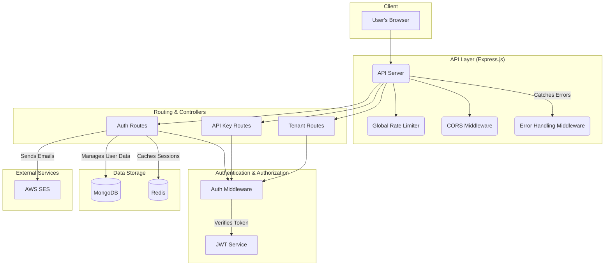

# ThrottleX API

ThrottleX is a secure and scalable Express API designed for multi-tenant applications. It provides a robust foundation for tenant authentication, OTP verification, and API key management, leveraging MongoDB for primary data storage and Redis for caching and session management.

## System Design



## Key Features

-   **Tenant Management**: Secure registration and login for different tenants.
-   **Authentication**: Robust JWT-based authentication with access and refresh tokens.
-   **Session Management**: Refresh token storage and rotation using Redis for enhanced security.
-   **Two-Factor Authentication**: OTP generation and verification via AWS SES.
-   **API Key Management**: Endpoints for generating and revoking tenant-specific API keys.
-   **Security**:
    -   Global and endpoint-level rate limiting to prevent abuse.
    -   Comprehensive error handling middleware for standardized responses.
    -   Environment variable validation at startup to ensure configuration is correct.
-   **Protected Routes**: Middleware to secure tenant-specific endpoints.

## Tech Stack

-   **Backend**: Node.js with ES modules, Express 5
-   **Database**: MongoDB with Mongoose for data modeling
-   **Caching**: Redis (ioredis) for session and token management
-   **Authentication**: JSON Web Tokens (jsonwebtoken)
-   **Email Service**: AWS SES v3 SDK for sending OTPs
-   **Validation**: Joi for environment variable validation

## Project Structure

```text
.
|-- index.js
|-- config/
|   |-- env.js
|-- api/
|   |-- controllers/
|   |   |-- auth.controller.js
|   |   |-- tenant.controller.js
|   |   |-- apiKey.controller.js
|   |-- middleware/
|   |   |-- auth.middleware.js
|   |   |-- ratelimiter.middleware.js
|   |   |-- error.middleware.js
|   |-- models/
|   |   |-- tenant.models.js
|   |   |-- apiKey.models.js
|   |-- routes/
|   |   |-- auth.routes.js
|   |   |-- tenant.routes.js
|   |   |-- apiKey.routes.js
|   |-- utils/
|       |-- ApiError.js
|       |-- ApiResponse.js
|       |-- asyncHandler.js
|       |-- generateApiKey.js
|       |-- generateOtp.js
|-- aws/
|   |-- ses.js
|-- database/
|   |-- database.js
|   |-- redis.js
|-- redis/
|   |-- jwt.js
|-- package.json
|-- README.md
```

## Prerequisites

-   Node.js 18+
-   A running MongoDB instance
-   A running Redis instance
-   AWS SES credentials with a verified sender identity

## Getting Started

1.  **Clone the repository**:
    ```bash
    git clone <repository-url>
    cd ThrottleX
    ```

2.  **Install dependencies**:
    ```bash
    npm install
    ```

3.  **Set up environment variables**:
    Create a `.env` file in the project root and add the required variables. See the `Environment Variables` section below for details.

4.  **Run the development server**:
    ```bash
    npm run dev
    ```
    The server will start on the port specified in your `.env` file (default is 3000).

## Environment Variables

Create a `.env` file in the project root with the following variables:

```env
# Server Configuration
PORT=3000
NODE_ENV=development

# MongoDB Connection
MONGO_URI=mongodb://localhost:27017/throttlex

# CORS Configuration (comma-separated for multiple origins)
CORS_ORIGIN=http://localhost:5173

# Redis Connection
REDIS_HOST=localhost
REDIS_PORT=6379
REDIS_PASSWORD=

# JWT Secrets
ACCESS_TOKEN_SECRET=your-strong-access-token-secret
REFRESH_TOKEN_SECRET=your-strong-refresh-token-secret

# AWS SES Configuration
AWS_ACCESS_KEY_ID=your-aws-access-key-id
AWS_SECRET_ACCESS_KEY=your-aws-secret-access-key
AWS_SES_REGION=your-aws-region
AWS_SES_SOURCE_EMAIL=your-verified-sender-email@example.com
```
```

### Strict Startup Validation

The app validates required env vars in `config/env.js` before startup. If any required variable is missing or blank, the process exits with an error.

Required env vars:

- MONGO_URI
- ACCESS_TOKEN_SECRET
- REFRESH_TOKEN_SECRET
- AWS_ACCESS_KEY_ID
- AWS_SECRET_ACCESS_KEY
- AWS_SES_REGION
- AWS_SES_SOURCE_EMAIL

`PORT` is optional, but if set it must be numeric.

## Install and Run

```bash
npm install
npm run dev
```

Production:

```bash
npm start
```

Default server URL: `http://localhost:3000`

## Mounted Routes

- `/api/auth`
- `/api/tenant`
- `/api/apikey`

## API Endpoints

### Health

- `GET /`

### Auth

1. `POST /api/auth/register`
Body:

```json
{
  "name": "Acme Inc",
  "email": "owner@acme.com",
  "password": "StrongPass123!",
  "accountType": "test"
}
```

2. `POST /api/auth/login`
Body:

```json
{
  "email": "owner@acme.com",
  "password": "StrongPass123!"
}
```

3. `POST /api/auth/refresh`
- Requires `refreshToken` cookie

4. `POST /api/auth/logout`
- Uses refresh cookie when present

### Tenant

All tenant endpoints require `Authorization: Bearer <accessToken>`.

1. `POST /api/tenant/send`
2. `POST /api/tenant/verify`
Body:

```json
{
  "otp": "123456"
}
```

3. `GET /api/tenant/profile`

### API Keys

All API key endpoints require `Authorization: Bearer <accessToken>`.

1. `POST /api/apikey/generate`
- Generates a tenant API key and returns it once in response.

2. `POST /api/apikey/revoke`
Body:

```json
{
  "keyId": "your-key-id"
}
```

## Response Format

Successful responses follow this shape:

```json
{
  "statusCode": 200,
  "message": "...",
  "data": {}
}
```

## Rate Limits

- Global API limiter: 1000 requests per IP per 60 minutes
- Register: 5 requests per IP per 15 minutes
- Login: 10 requests per IP per 10 minutes
- OTP send: 3 requests per IP per 10 minutes
- OTP verify: 10 requests per IP per 10 minutes
- API key generate/revoke: 5 requests per IP per 60 minutes

## Common Issues

1. `Refresh token missing`
- Ensure the client sends cookies (`credentials: "include"` for fetch or `withCredentials: true` for Axios).

2. `Origin not allowed by CORS`
- Add your frontend origin to `CORS_ORIGIN`.

3. OTP email is not sent
- Verify AWS credentials, SES region, and SES source identity.

4. Redis connection error
- Verify `REDIS_HOST`, `REDIS_PORT`, and optional `REDIS_PASSWORD`.

5. MongoDB connection failure
- Verify `MONGO_URI`.

## Notes

- `dockerfile` is present but currently scaffold-level and not production-ready.
- There are currently no automated tests in this repository.

## Security Notes

- Use strong, unique JWT secrets.
- Never commit real credentials.
- Set `NODE_ENV=production` in production deployments.
